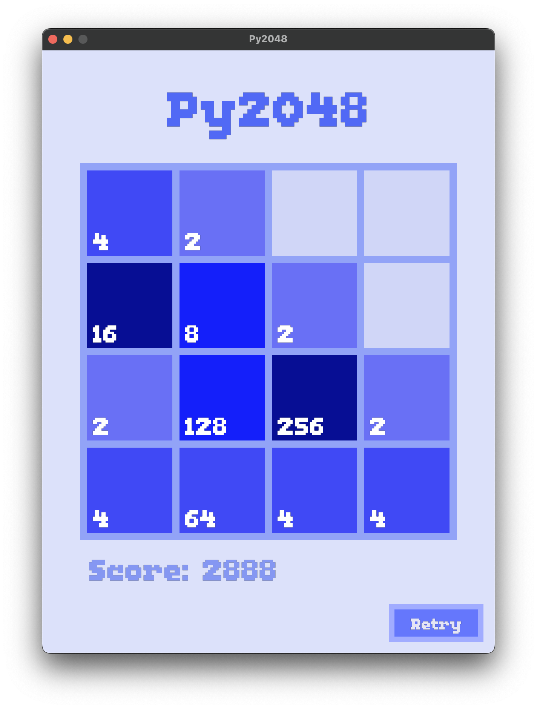

# Py2048
A 2048 game written on Python using the Pyglet library.


### Dependencies
- pyglet

## How to run
### 1. Clone this repository

```
git clone https://github.com/pixdv/py2048
cd py2048
```
### 2. Create and activate virtual enviroment

**venv**
```
python3 -m venv .venv
source .venv/bin/activate
```
> for MacOS/Linux

```
python3 -m venv .venv
.venv\Scripts\activate
```
> for Windows

**or any other tool**

### 3. Install pyglet
**venv**
```
pip install pyglet
```
**or with the tool you chose**

### 4. Run the game
**venv**
```
python3 2048.py
```
**uv**
```
uv run 2048.py
```
**or with the tool you chose**

## How to play
- Use the arrow keys to move the squares
- Press the retry button if you want to restart

## License
This project is licensed under the MIT License - see the [LICENSE](LICENSE) file for details.

## Credits
Font: [Not Jam UI 12](https://not-jam.itch.io/not-jam-ui-12) by Not Jam - licensed under CC0